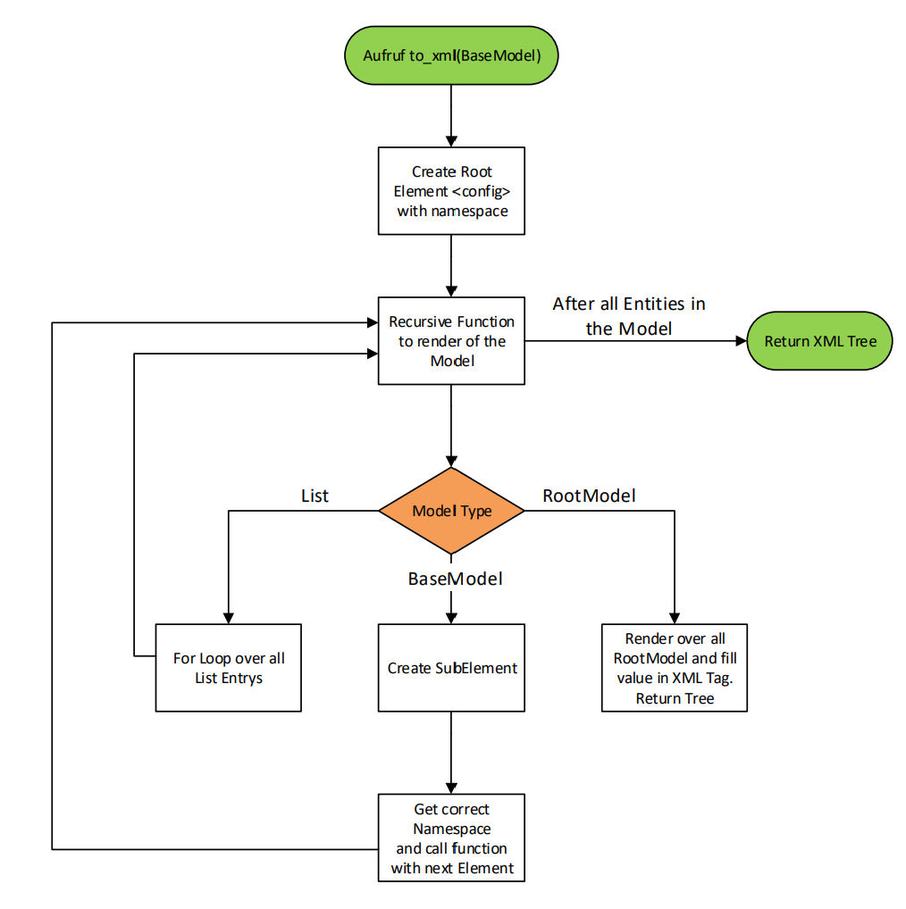
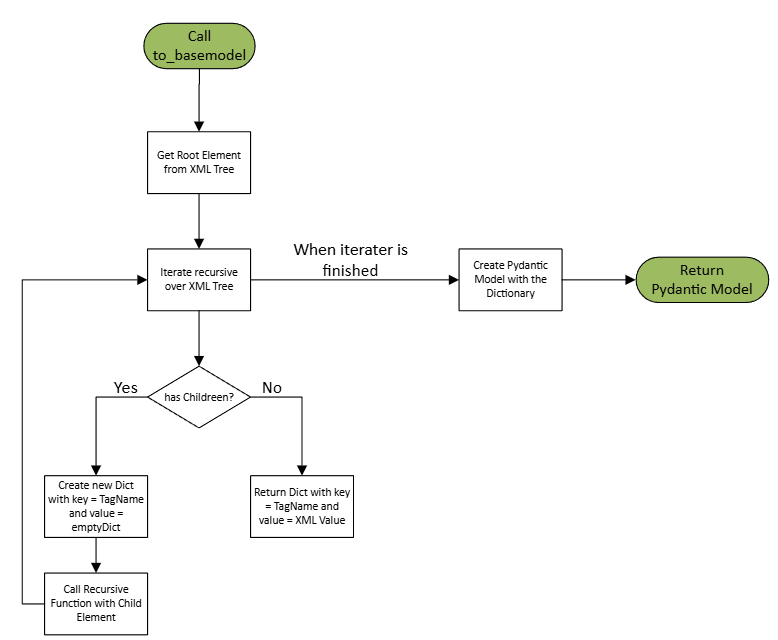

# NetconfXMLExporter
Convert a Pydantic Model into an Netconf conform XML or fill Data from a Netconf XML into a Pydantic Model.

## Requirements and Version
The XML Exporter is written Pin ython and uses the following Libraries:
- Python: 3.12
- lxml: 5.3.0
- pydantic: 2.9.0

## Installation
1. Install Python Modules with "pip install lxml pydantic"
2. Clone Project "git clone https://github.com/raemsli/NetconfXMLExporter/new/main?readme=1"

## Workflow
Here are described how the Exporter works
#### to_xml


#### to_basemodel


## Demo 1 - Convert a Pydantic Model into an Netconf conform XML 
In this Repo is a short Demo of the Exporter. The Pydantic Models in this Repo are created with Pydantify and as base the Cisco Native and Openconfig YANG Models.
To Export my Function, add this Code to your script:
from XMLExporter import xmlexporterclass
```
python3 testcode_toxml.py
```
## Demo 2 - Fill Data from a Netconf XML into a Pydantic Model.
In this Repo is a short Demo of the Exporter. The Pydantic Models in this Repo are created with Pydantify and as base the Cisco Native and Openconfig YANG Models. The Netconf XML are exporter from a Cisco Catalyst Switch 9300.
To Export my Function, add this Code to your script:
from XMLExporter import xmlexporterclass
```
python3 testcode_tobasemodel.py
```

## Limitations
Here are some Limitations listed for the Functions:

#### Function to_xml
- The Pydantic Model needs to have the same Structure as the Cisco Switch needs
- Namespace of the Cisco Switch are often not the same as in the YANG Model listed

#### Function to_basemodel
- From the following Port Types must be at least 2:
	- GigabitEthernet
	- TenGigabitEthernet
	- TwentyFiveGigabitEthernet
	- FortyGigabitEthernet